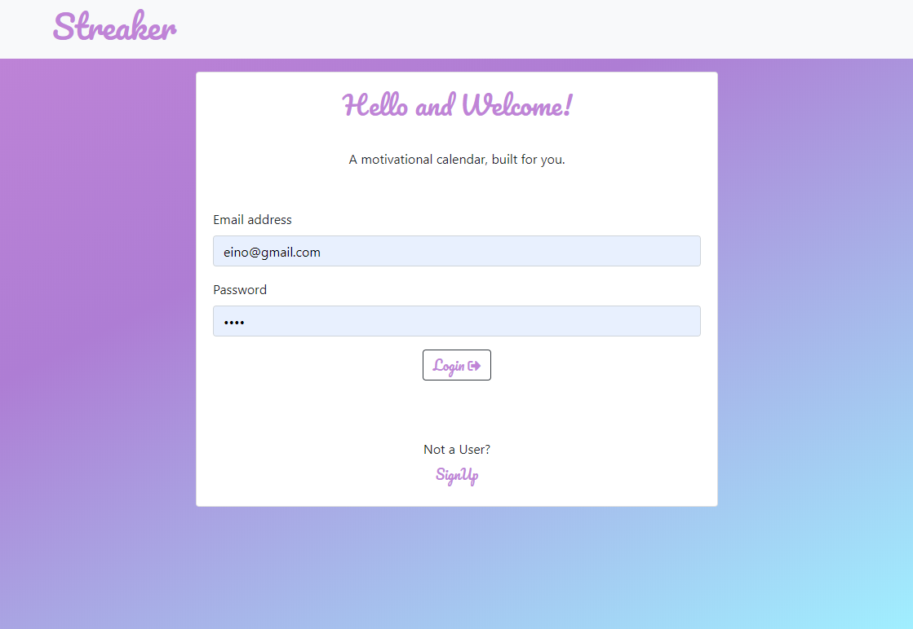
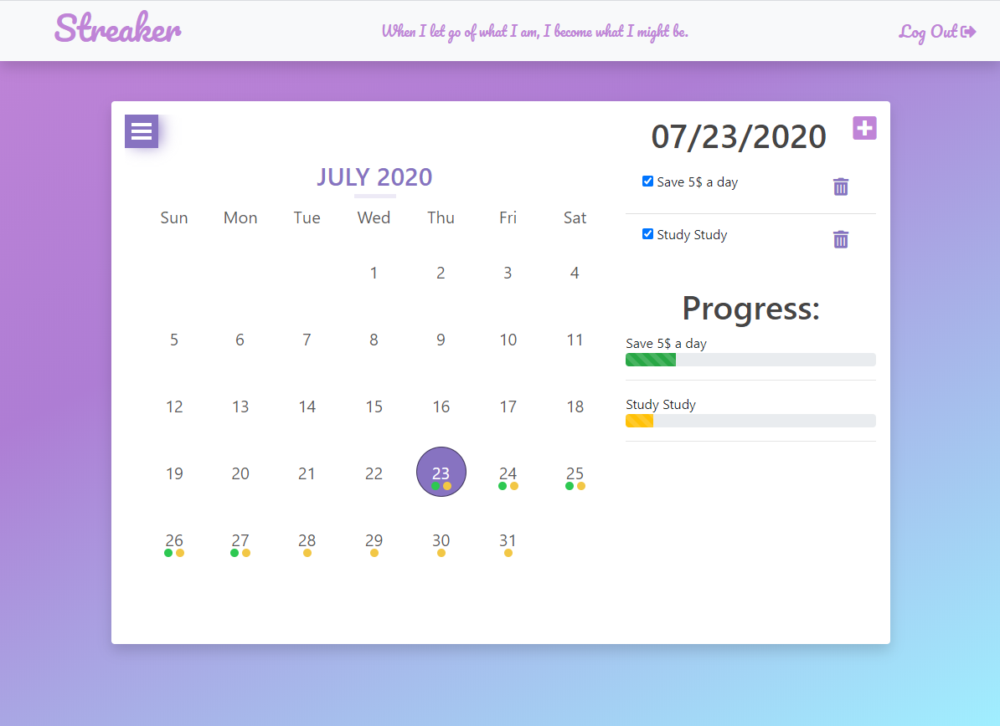

# Planner-app

An APP, that takes user input for goal (description) and dates, which marks it on the calendar. 

During the APP operation, user input is stored in a database.

Checkboxes are used for marking the goal, and updates a goal tracker bar.

# Table of Contents
1. [User Story](#user-story)
2. [Technology Used](#technology-used)
3. [Essential Code](#essential-code)
4. [Future Development](#future-development)
5. [Heroku Deploy](#heroku-deploy)

## User Story
```
AS A student,

I WANT an APP to store my goals,

SO THAT I can track my success!

```

## Technology Used 

HTML/CSS:
1. 

Back-end:
1. 

## Essential Code




## Future Development

- Analysis page to compare and track goals

- Additional date selection options

- Streaks for each goal!

- Choose between multiple theme colors

- User settings

- Accomplished short-term goals list

## Heroku Link

Deployed website can be found at [here](https://streaker-app.herokuapp.com/).